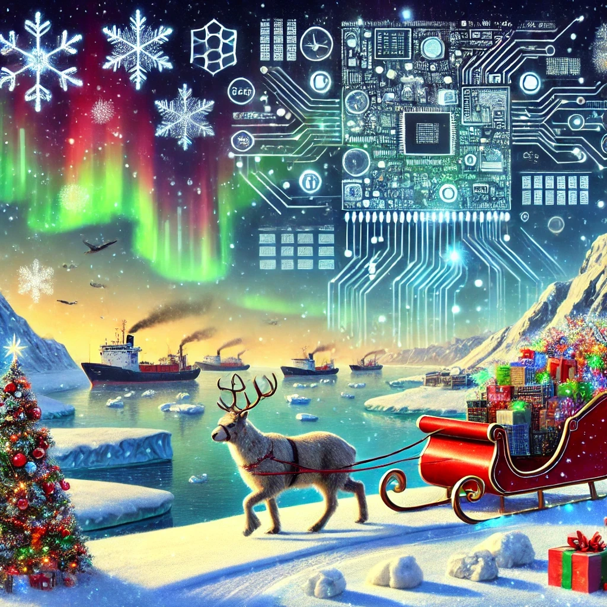

"Data Flows"  
(To the tune of "Jingle Bells")

**Verse 1**  
Dashing through the ice,  
In a data-driven sleigh,  
Mapping Arctic sights,  
In a supercompute array.  
Big data streams align,  
Patterns start to show,  
Geodiversity in time,  
Where macrosystems grow.  

**Chorus**  
Oh! Data flows, models grow,  
Vessels on the move!  
In Arctic waves, we analyze,  
Insights to improve. Hey!  
Data flows, systems glow,  
Science lights the way,  
Macroscapes of change unfold,  
Each computational day.  

**Verse 2**  
Vessel traffic hums,  
Through Arctic Alaskan seas,  
Where changing systems drum,  
In ecological keys.  
Supercomputers hum,  
Crunching vast terrain,  
To forecast future outcomes,  
And help the world sustain.  

**Chorus**  
Oh! Data flows, models grow,  
Vessels on the move!  
In Arctic waves, we analyze,  
Insights to improve. Hey!  
Data flows, systems glow,  
Science lights the way,  
Macroscapes of change unfold,  
Each computational day.  

**Bridge**  
Through the icy shifts,  
Geodiversity calls,  
Tracking trends and drifts,  
Where macrosystems sprawl.  
From big data's might,  
A picture comes to light,  
Of Arctic change and vessel strains,  
Beneath the polar night.  

**Chorus**  
Oh! Data flows, models grow,  
Vessels on the move!  
In Arctic waves, we analyze,  
Insights to improve. Hey!  
Data flows, systems glow,  
Science lights the way,  
Macroscapes of change unfold,  
Each computational day.  

